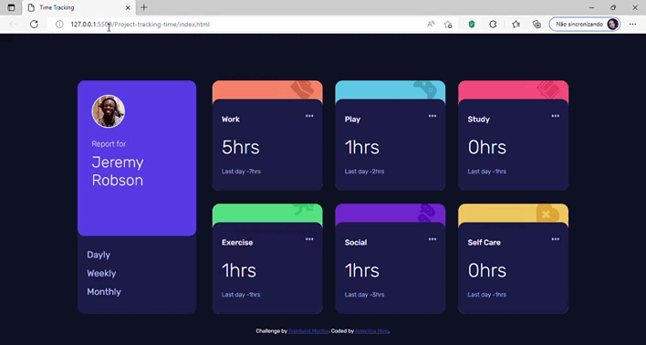

# Frontend Mentor - Time tracking dashboard solution

Este projeto é o [Time tracking dashboard challenge on Frontend Mentor](https://www.frontendmentor.io/challenges/time-tracking-dashboard-UIQ7167Jw). Desafio encontrado no Frontend Mentor que tem objetivo de melhorar habilidade de codificação criando projetos realistas. 

## Visão Geral

### O desafio

Usuários devem ser capazes de:

- Visualizar o layout ideal para o site, dependendo do tamanho da tela do dispositivo
- Ver os estados de foco(hover) para todos os elementos interativos na página
- Alternar entre a visualização de estatísticas diárias, semanais e mensais

### Screenshot

### Links

- Solution URL: [Repositório Github](https://github.com/ajuliamm/Project-tracking-time)
- Live Site URL: [Link Site](https://ajuliamm.github.io/Tracking_time_dashboard/)

## Meu processo

### Construído com

- Semantic HTML5 markup
- CSS custom properties
- Flexbox
- CSS Grid
- Javascript

## Author

- Linkedin - [Angelina Melo](https://www.linkedin.com/in/angelinamelo/)
- Github - [Angelina Melo](https://github.com/ajuliamm)